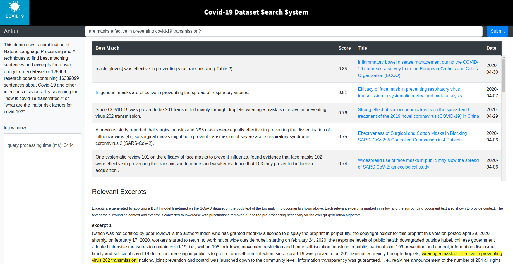

# Fast question-answering on Covid-19 dataset using BERT style models finetuned on Squad 2

**Covid-19 Fast QA** is an interactive experimental tool leveraging a state-of-the-art language models to search relevant content inside the [COVID-19 Open Research Dataset (CORD-19)](https://pages.semanticscholar.org/coronavirus-research) recently published by the White House and its research partners. The dataset contains over 100,000 scholarly articles about COVID-19, SARS-CoV-2 and related coronaviruses.

The system uses a similarity lookup on a database of sentence embeddings to identify relevant sentences and associated documents. It then identifies relevant excerpts in the body text of the top matching documents by applying a BERT model fine-tuned on the SQuAD dataset. Fast inference is achieved by tokenizing the document content during pre-processing and then adjusting the tok-to-orig indices based on the number of tokens in the query. This results in a 5x speed up over the default transformers implementation which performs tokenization for every query. The system can also take advantage of multiple GPUs by splitting up a batch of BERT spans along the batch dimension to be processed in parallel using data-parallelism. 

A screenshot of the system frontend (query results are marked in yellow) are shown below. 




## Setup

Tested on: Ubuntu 18.04, CPU only and with 2 1080Ti GPU. Docker version 19.03.5

First clone the repo. Then, [download](https://drive.google.com/drive/folders/1w0TjWZA_vpxVewkHUTiSyVS9Exz-g1VW) *models.tar.gz* and *cord19q_etl.tar.gz* which contain the pre-trained BERT models and cord19q pre-processed data (output of the cord19q [ETL process](https://www.telesens.co/2020/06/10/building-a-information-retrieval-system-based-on-the-covid-19-research-challenge-dataset-part-1/)).
 
Create a */data* directory and two sub-directories - */data/models* and */data/cord19q/current*. Unzip models into */data/models* and unzip cord19q_etl into */data/cord19q/current*. 
 
 Download the original papers from [Covid-19 research dataset challenge](https://www.kaggle.com/allen-institute-for-ai/CORD-19-research-challenge) and place the document_parses folder in */data/cord19q/current*. This folder contains the fulltext of the papers used in our search system. 
 
 For example
 Your *data/cord19q/current* folder should look like this:
 ```js
    - document_parses/
    - articles.sqlite
    - cord19-300d.txt
etc.
```
and models should look like this:    
```angular2
/data/models/bert-base-uncased_finetuned_squad model
   -vocab.txt
   -pytorch_model.bin
   -config.json
```
Similarly for bert-large-uncased-whole-word-masking-finetuned-squad.

Download [NLTK data](https://www.nltk.org/data.html). You can change the path where nltk_data is installed using the *-d* option. Note the path where you install it.

Open kube/ctnr_mgmt.sh and adjust the last argument to the *run_apache_proxy_server* and *run_application_server* commands. This argument should be the directory path where you cloned the repo. This path is used in the docker volume mapping. Also, adjust the nltk_data path in the docker run command in the *run_application_server* command to where you installed nltk_data.

Ensure that you have docker installed and are able to run it without sudo. See [instructions](https://docs.docker.com/engine/install/linux-postinstall/).

If you don't have GPUs on your system, set USE_GPU=0 and remove *--gpus all* in the docker run command in *run_application_server*. For GPU support, see the *GPU Support* section below.

Run *kube/ctnr_mgmt.sh*

Open a browser and go to *localhost:8082/covid-demo/main.html*. You should see the application frontend and be able to type queries and get search results.

##How it works

The core search functionality is implemented in *covid_browser/api_impl.py* and exposed via the *cord19q_lookup* (terrible name, I know..) endpoint, implemented in *src/covid_browser/modelapi.py*. 
 
The endpoint receives a user query (eg: "where did covid-19 originate"), and returns back top-n matching sentences, information about the corresponding article such as title, data published, URL etc and relevant excerpts. The top-n matching sentences are the output of a sentence similarity search and excerpts are generated by applying a BERT model fine-tuned on the SQuAD QA dataset. 

For details about the sentence similarity search, see this [blog post](https://www.telesens.co/2020/06/10/building-a-information-retrieval-system-based-on-the-covid-19-research-challenge-dataset-part-2/) and [this post](https://www.telesens.co/2020/06/16/building-a-information-retrieval-system-based-on-the-covid-19-research-challenge-dataset-part-3/) for excerpt generation using the fine-tuned BERT model.

The application server can be run directly (via python command line or IDE) or as a docker container. It expects three environment variables - BASE_PATH (the base application directory), USE_GPU (set to 1 if your computer has a supported GPU - eg. Nvidia 1080Ti, 0 otherwise) and PORT (the port number the Flask application server listens on). See *run_application_server* in *kube/ctnr_mgmt.sh* for how to run *docker build* and *docker run* commands. Note the docker volume mapping and port mapping options. You should change the host path to the correct directory path where you cloned the repo. If you wish to run the server using Python command line or in an IDE, just set the necessary environment variables (eg., using the Environment variables configuration in Pycharm) and run covid_ir.py. 

The application Docker container is built using the Dockerfile in the main directory. This Dockerfile does the following: 
* Install Ubuntu 18.04 with CUDA 10.1
* Install Python3.7 and Pip
* Install Pytorch 1.5 with CUDA support 
* Install other dependencies (see requirements.txt) - Flask, Transformers etc.
* Copy parent application directory to /app in Docker container (except the contents of the data directory, see .dockerignore, to keep the size of the image small). Docker volume mapping is used to map the data directory on the host to the container when we run the container.
* Start a Flask server on 0.0.0.0/PORT (PORT number is specified as an env variable)

The application container logs are mapped to log/logs.txt

## GPU Support
To enable GPU acceleration within the Docker container, follow these [instructions](https://github.com/NVIDIA/nvidia-docker). 

```angular2
# Add the package repositories
distribution=$(. /etc/os-release;echo $ID$VERSION_ID)
curl -s -L https://nvidia.github.io/nvidia-docker/gpgkey | sudo apt-key add -
curl -s -L https://nvidia.github.io/nvidia-docker/$distribution/nvidia-docker.list | sudo tee /etc/apt/sources.list.d/nvidia-docker.list

sudo apt-get update && sudo apt-get install -y nvidia-container-toolkit
sudo systemctl restart docker
```

To run with GPU support, set the `USE_GPU` environment variable to 1. See *run_application_server kube/ctnr_mgmt.sh()

## Application Frontend
The application frontend is implemented in */apache* and served by an Apache server running as a docker container. See *run_apache_proxy_server* in *kube/ctnr_mgmt.sh* for how to run *docker build* and *docker run* commands. The *ctnr_mgmt.sh* script runs two Apache servers on ports 8000 and 8082. For local deployment, you only need the Apache server running on port 8082. This server serves HTML/js content located in *apache/dev/static* and proxies the traffic at endpoints */cord19q_lookup*, */healthcheck* and */stats* (see *apache/dev/covid-demo.conf*) to the application server. Note that the IP address of the docker bridge (172.17.0.1) is used in the proxy settings. If you are running the application server directly (eg. in a Python IDE, or using the command line) then this should be replaced by the localhost address (127.0.0.1)

Once the application and Apache server containers are running, open a browser and type:http://localhost:8082/covid-demo/main.html. You should see the application frontend (see screenshot above).

## Code structure
The code is structured as follows:
* The *apache* directory contains the javascript, html, css and apache server config files. There is a development version in the dev folder and a "prod" version in the sites folder. For local deployment, you only need the dev version. The two versions use a common Dockerfile and config (apache/httpd.config). The Dockerfile builds the Apache container image used to run the two local Apache servers on different ports - 8000 and 8002 (see kube/ctnr_mgmt.sh). Since you'll be running the application locally only, you only need the dev apache server. 

* *data/model* contains the BERT large and small models
* *data/cord19q* contains the Covid-19 research dataset and output of the cord19q ETL process
* *src/cord19q* contains the cord19q ETL code. See [this](https://www.telesens.co/2020/06/10/building-a-information-retrieval-system-based-on-the-covid-19-research-challenge-dataset-part-1/) for how the ETL process works.
* *src/covid_browser* contains the application code, BERT lookup etc. 
